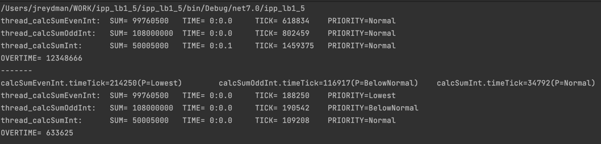
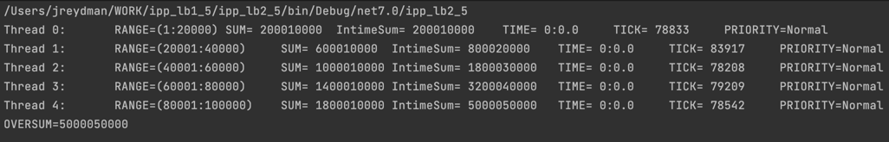
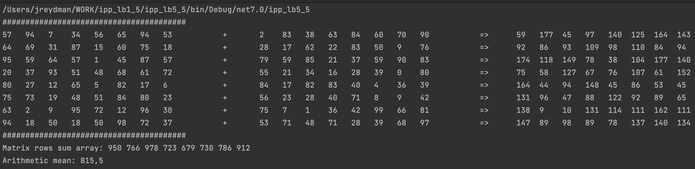

     ---------------------------------------------------------------
    |                             КАФЕДРА ЭВМ                       |
    |                               КУРС                            |
    |            ИНТЕРФЕЙСЫ ПАРАЛЛЕЛЬНОГО ПРОГРАММИРОВАНИЯ          |
    |                                                               |
    |   СТУДЕНТ:    Мавринский Александр Денисович                  |
    |   КУРС:       3                                               |
    |   ГРУППА:     КиуКи-20-5                                      |
    |   Вариант:    5                                               |
    |                                                               |
    |   ЛАБОРАТОРНЫЕ РАБОТЫ:                                        |
    |   - управление процессами и потоками                          |
    |   - Объекты синхронизации потоков и процессов                 |
    |   - Обмен данными между программами на основе объекта Socket  |
    |   - Интерфейс параллельного программирования MPI/OpenMP       |
     ---------------------------------------------------------------
___
### Результаты выполнения лабораторных работ
___
(укр.)Завдання:
Програма може запускати три потоки: перший – обчислює суму цілих чисел від 1 до 10 000, другий – суму парних чисел від 1 000 до 20 000, третій – суму непарних чисел від 3 000 до 21 000. Програма автоматично визначає час, затрачуваний на обчислення кожним з потоків, після чого динамічно змінює пріоритети потоків таким чином, щоб мінімальний за часом потік одержав максимальний пріоритет. Вивести на екран загальний час обчислень до і після зміни пріоритетів.

___
(укр.) Завдання:
Необхідно обчислити суму чисел від 1 до 100 000. Створити 5 потоків, кожний з який обчислює частину цієї суми (перший потік – від 1 до 20 000, другий – від 20 001 до 40 000 і т.д.). Організувати синхронізацію потоків таким чином, щоб результат формувався по завершенню останнього з потоків. Вивести на екран результат і часи, витрачені на обчислення кожним з потоків.

___
(укр.) Завдання:
У програмі-клієнті знаходиться 3 кнопки, що відповідають лінії, прямокутнику й еліпсу. Після натискання однієї з кнопок у програмі-сервері за допомогою миші малюється відповідна фігура.

Server:

Client:

___
(укр.) Завдання:
Написати програму складання двох матриць великої розмірності. В результуючої матриці знайти суму елементів кожного рядка і занести результат в окремий масив. Визначити слреднее арифметичне результуючого вектора.
